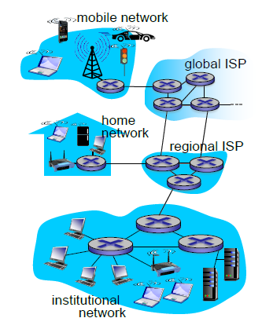
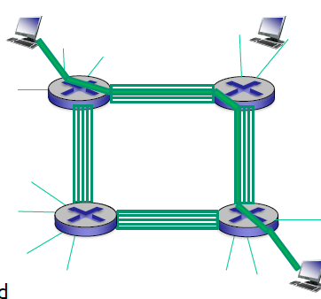
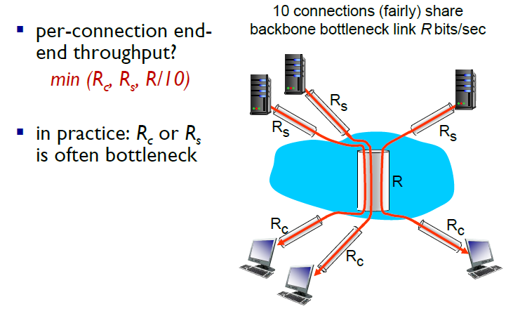

# Chapter 1 - Introduction/Overview

## Internet
- "nuts and bolts"
- Applications
  - internet: "network of networks"
    - interconnected ISPs
  - protocols control sending, receiving of messages
  - internet standards
    - RFC: request for comments
    - IETF: Internet Engineering Task Force
- service view 
  - infrastructre that provide services to applications
    - web, VOIP, email...
  - provides programming interface to app proogam

## Protocol
- human protocols
  - entity: humans
- network protocols
  - entities - machine
  - all communication activities in internet governed by protocols
- define format, order of messages send and received, and action taken

## Network Edge
- network edge:
  - host: client & servers
  - server often in data center
- access network, physical media: wired, wireless communication link
- network core: interconnect routers

### End Systems

### Access Networks
##### Access networks and physical media
- How to connect end system to endge router
  - residential access nets
  - institutional access networks
  - mobile access networks
- band width(data rate) of access network

##### Access network: digital subscriber line(DSL)
- use existing telephone line to central office DSLAM
  - data goes Internet
  - voice goes telephone net
  - DSL dedicated access to central office
- < 2.5Mbps upstream(typically < 1Mbps)
- < 24Mbps downstream(typically < 10Mbps)

##### Access network: cable network
- HFC: hybrid fiber coax
- share access network
- frequency division multiplexing
- **Access network: home network**

##### Enterprise access networks(Ethernet)
- used in company, universities
- end system typically connected into Ethernet

##### Wireless access networks
connects end system to router
- wireless LANs/WiFi
- wide-area wireless access/3G,4G,LTE,5G

### Links
##### physical media
- signal
- physical link - b/t transmitter & receiver
- guided media - in solid media
- unguided media - radia
- *twisted pair(TP)  - copper wire

##### Coax, fiber
- coaxial cable
  - 2 concentric copper conductor
  - bidirectional
  - broadband
- fiber optical cable
  - glass fiber carry light pulses
  - high-speed
  - low error rate

##### Radio
- signal carried in EM spectrum
- bidirectional
- propagation environment effects: reflection, obstruction by objects, interference
- terrestrial microwave/LAN/wide-area/satellite

**Packet transmission delay**
- packet transmission delay = time needed to transmit L-bit packet into link 
- = L(packetlength/bit) / R(transmission rate/link bandwidth/capacity)

## Network Core
#### Packet Switching
- host break message into packet
- transmit across the link/ at full link capacity
**store-and forward:** must arrive and store at router then transmit
 - end-end delay = 2L/R(no propagation delay)
**queuing delay, loss** arriving rate > transmission reate
 - queue at router, wait
 - dropped/lost if memory/buffer fills up
**2key network-core functions**
- routing
  - determine transmission route/routing algorithm
- forwarding
  - move packet from router input to proper output
### Circuit Switching

- 4 circuit...
- dedicate resource
- no sharing/circuit segment

### packet switching vs. circuit switching
- circuit switching: 10 users
  - greater for bursty data: better
  - excessive congestion possible: better
  - bandwith guaranteed
- packet switching: 35 users, probability >10 active users at the same time <0.0004

excessive congestion possible:
### Network Structure
- O(n^2) connections(n: no. of access net)
global ISP to global ISP
- internet exchange point
- peering link
- regional net
- content provider networks(google)

## Performance
- packet queue in router buffer
- arrival rate > output link capacity
- no free buffer: loss

#### Delay
**D(nodal) = d(nodal processing) + d(queue) + d(trans) + d(prop)**
- nodal processing: check bit error/determine output link
- queuing delay:L(length)*a(arrival rate)/R(bandwidth) 
  - time waiting at output link for transmission, depends on congesting
- transmission delay: L/R
- propagation delay: d(length of physical link)/s(3*10^8m/s)

#### Loss
- router buffer has finite capacity
- full queue ->lost
- retransmit by previous node

#### Throughput
rate at which bits transferred between sender/receiver
- instantaneous: rate at given point in time
- average: rate over long period of time
- R(s): line capacity in pipe 1
- R(c): line capacity in pipe 2
1. Rs < Rc: rate = Rs
2. Rs < Rc: rate = Rc

**Internet scenario**

**check which one is minimum rate**

## Protocol Layers, service models
- layer: each layer implements a service

**why**
- dealing with complex system
  -  clearly identify relationship of complex system(reference model)
  -  modularization eases maintenance

#### Internet protocal stack
- application: supporting application - FTP, SMTP, HTTP
- transport: process data transfer - TCP, UDP
- network: routing from source to desination - IP
- link: data transfer = Ethernet
- physical: bits "on the wire"
- encapsulation

## History
