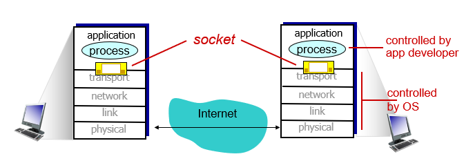
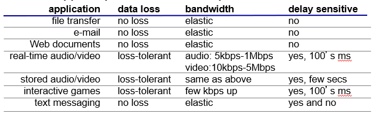
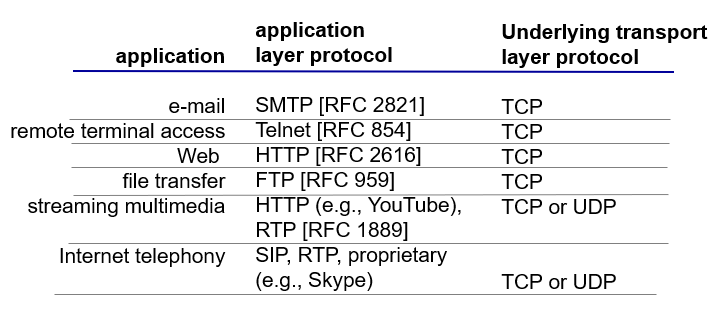
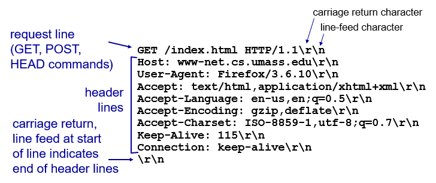
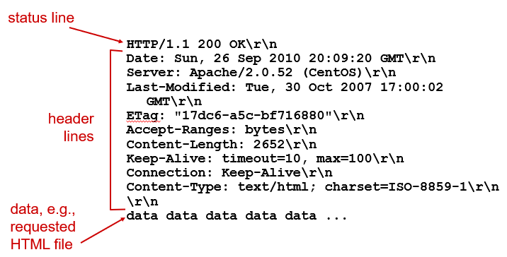
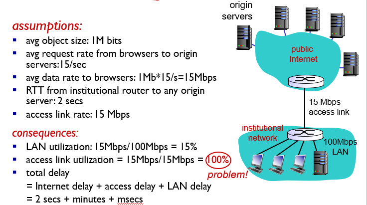
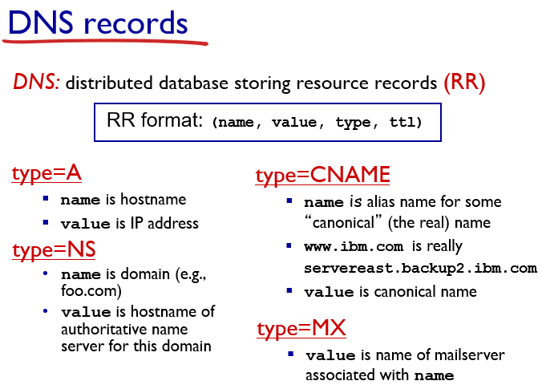
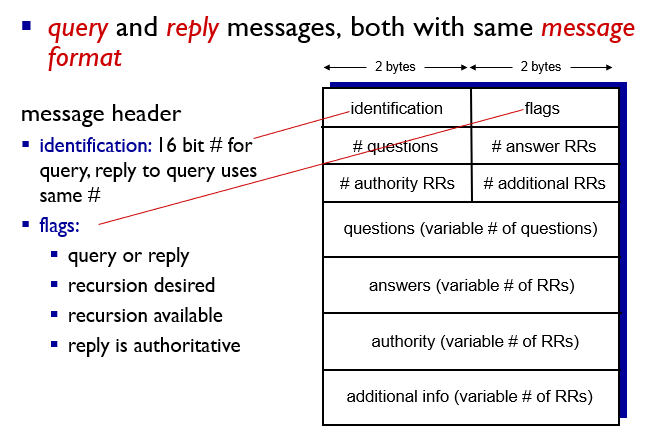
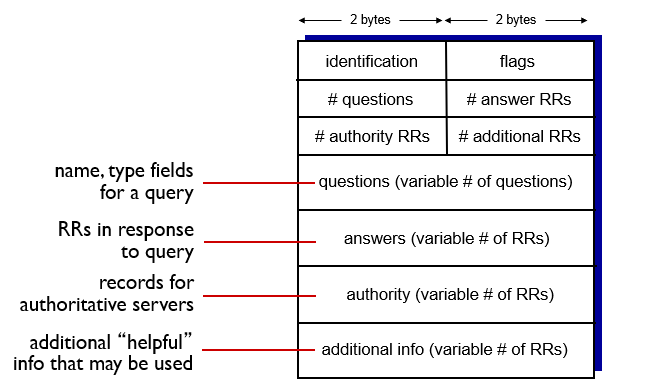

# Chapter 2 - Application Layer

## Principle of network applications
### Application Architectures

#### Client-server architecture
**server**
- always-on host
- permanent IP address

**client**
- communicate with server
- **maybe intermittently connected**
- may have dynamic IP address
- **do not communicate directly** with each other

#### P2P architecture
- no permanent always-on server
- arbitrary end systems **directly communicate**
- peer request service from other peer, then provide service in return to other peers
  - **self scalability**
- peer are **intermittently connected**
  - need **complex management**


### Inter-process communication
process: a program running in host
- within same host
- two processes communicate using inter-process communication
- processes in different host can communicate by exchanging messages

1. **client process:** initiate communication
2. **server process:** wait to be contacted
*P2P architecture have both 

### Sockets
process sends/receives messages to/from its sockets
- analogous to door
  - pushes message out door
  - relies on transport services out of the door to deliver message to door at receiving process


### Addressing Process
- process have identifier
- host IP cannot identify process
- port number is associated with a process on host
- **IP address and Port number**

### Transport service

- **data loss:** some apps(file transfer) require 100% reliable data transfer, some can tolerate(Audio)
- **delay sensitive:** some requires no delay, some don't care
- **bandwidth:** some requires minimum bandwidth, some make use of whatever

#### TCP and UDP
**TCP service:**
- conenction-oriented, reliable data transfer, flow control, congestion control
- does not provide: timing, minimum bandwidth guarantee

**UDP service:**
- unreliable data transfer
- does not provide: reliability, flow control, congestiong control, timing, bandwidth guarantee, connection setup



## Web and HTTP
### Web service
- consist base HTML file, embeds several reference objects(addressed by url)
- client/server model
  - client: browser requests web page
  - server: send objects response to client's requests

### HTTP overview
**HTTP: **
- application layer protocol
- message: request, response

**TCP:**
- client initiate TCP connect to server
- server accept TCP connection from client
- HTTP messages exchange b/t browser and web server
- TCP closed

HTTP is **stateless**, no info about past client request

### HTTP connection
#### non-persistent
- one object send, then close
- download multiple object requires multiple connection

**steps:**
1. client initiate TCP connection to server
2. server accept, notifies client
3. client send HTTP **request message** into TCP connection socket
4. server receive, then form **response message** containing object, send message into socket
5. server close TCP connection
6. receive response message
7. repeat step 1-6

**response time**
- RTT: time for small packet to travel from client to server and back
- HTTP:RTT initiate TCP, RTT for HTTP request, file transmissiong time

non-persist HTTP response time = 2RTT + file transmission time

#### persistent
- multiple object can be send over single TCP

**non-persistent issue**
1. require 2 RTT per object
2. overhead for each TCP connection
3. open parallel connection

**persistent:**
- leaves connection after send response
- message send over open connection
- 1 RTT for all referenced object

### HTTP request message format


#### HTTP method type
**HTTP/1.0**
- GET, POST, HEAD(ask server to leave request)

**HTTP/1.1**
- GET, POST, HEAD
- PUT(upload file to URL path)
- DELETE(delete file specified in URL)

#### Uploading form input
POST method: form input/in server
URL method: GET method/in URL

### HTTP reponse message format


#### HTTP Response status code
- 200 OK
- 301 Moved Permanently
- 304 Not Modified
- 400 Bad Request
- 404 Not Found
- 505 HTTP Version Not supported

### Cookie(user-server state)
**Components**
1. cookie header line in HTTP response message
2. cookie header line in next HTTP request message
3. kept on user's host, managed by browser
4. back-end database at web site
  
**Usage**
- authorization
- shopping cart
- recommendation
- user session state
  
http message carry state

### Caching(proxy server代理服务器)缓存
**satisfy client request without involving origin server**
#### Reason:
- reduce response time for client request 减少请求响应时间
- reduce traffic on access link 减少一个机构的接入链路到因特网的通信量

#### calculation

avg object size * avg request rate from browser to server = avg data rate to browser
RTT(internet delay)
avg data rate /access link rate = access link utilization
total delay = internet delay + access delay + LAN delay
increase access link speed(no cheap)

example:


#### Conditional GET
如果缓存有最新的对象版本则无需重新发送

1. If-modified-since: < date >
2. (not modified after date): 304 Not modified
3. (modified after date): 200 OK < data >

## Electronic mail
### Components
#### user agent 用户代理
mail reader
#### Mail servers 邮件服务器
- mailbox: incomming messages
- message queue: outgoing message to be send
#### Simple Mail Transfer Protocol: SMTP
- use TCP, port 25
- direct transfer
- 3 phase
  - handshaking, transfer message, closure
- command/response interaction
  - command: ASCII text
  - response: status code & phrase
- persistent connection
- require message: header & body in 7-bit ASCII
- SMTP server use CRLF.CRLF to end
#### **Comparision to HTTP**
- HTTP: pull, each object encapsulate in its own response message
- SMTP: push, multiple object send in multipart message
- both: have ASCII command/response, interaction, status code
- 

**
拉协议：就是有人来访问副本服务器上的数据时，副本服务器会检查主副本服务器上要被访问的数据是否有更新，有更新的话，则从主副本服务器获取最新数据缓存到本地，然后向访问者返回最新数据；否则，则直接返回本地缓存的副本数据；

推协议：与拉协议相反，在主副本与多个副本之间存在着这种关系：一旦主副本的数据有更新，则它会主动向所有副本服务器推送此更新，以便使所有副本之间保持高效的一致性；

通过对比二者，我们很容易想到，推协议更适用于读与更新比率较高的场景，否则的话，如果数据更新较频繁，而又采用推协议，将会费时费力；相对应，拉协议更适用于读与更新比率较低的场景
**

#### Message Format
```
格式
header
  To:
  From:
  Subject:
body: 只允许ASCII
```


### Mail Access Protocol
#### POP3 protocol - Post Office Protocol

Authorization phase
- client command
  - **user**: declare username
  - **pass**: password
- server response
  - **+OK**, **-ERR**

Transaction phase, client
- **list**: list message numbers
- **retr**: retrieve message by number
- **dele**: delete
- **quit**

More
- download & delete Mode
- stateless across session

#### IMAP protocol - Internet Mail Access Protocol
- keeps all message on server
- allow user to organize message in folder
- keep user state across session


##### HTTP: gmail, hotmail...
##### with multimedia
Multipurpose Internet Mail Extension(MIME) 多用途因特网邮件扩展


## DNS(use UDP, port 53)
- distributed database(many server in hierarchy) 由分层的DNS服务器实现的分布式数据库
- application layer protocol: host communicate to resolve names 一个使得主机能够查询分布式数据库的应用层协议


服务
- hostname to IP address translation 主机名到IP地址的转换
- Host aliasing 主机别名
- Mail server aliasing 邮件服务器别名
- Load distribution 负载分配


#### Root name, TLD, authoritative DNS server
- **Root name server 根DNS服务器**
- **TLD(top-level domain) servers顶级域DNS服务器** 负责顶级域名
- **Authoritative DNS servers** 权威DNS服务器, for organization, maintained by organization 
- **Local DNS server**本地DNS服务器
  - not strictly belong to hierachy
  - each ISP has one
  - DNS query made by host send to here

#### Query type
iterative query: name of server, ask serve
recursive query: burden name resolution on contacted name server

#### DNS Caching DNS缓存
may out-of-date


#### DNS records DNS记录


#### DNS protocol message




## Socket Programming with UDP and TCP
