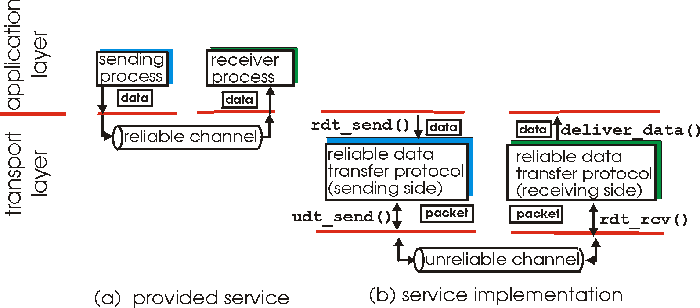
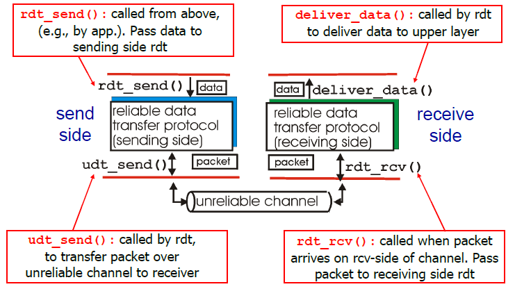
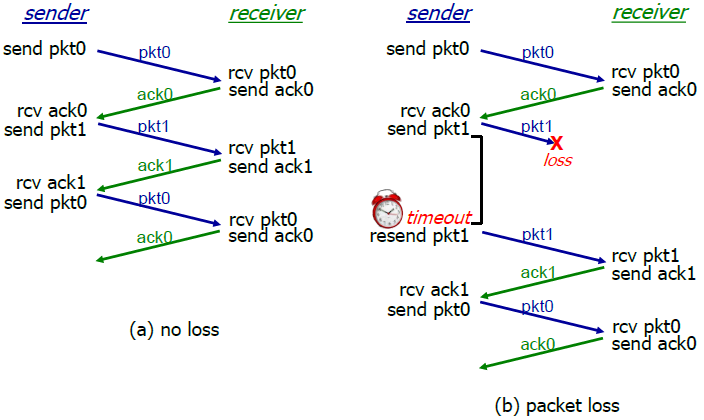
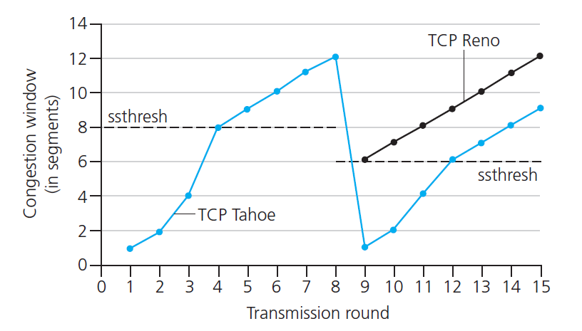

# Chapter 3 - Transport Layer

## Transport Layer Service
- provide logical end-to-end connection b/t app process
- logical communication
- demultiplexing / multiplexing
- segments pass to network layer

### Transport layer vs. network layer
- network layer: logical connection between hosts
- transport layer: logic connection between processes

## Multiplexing and demultiplexing
Demultiplexing 多路分解
- use header info. to deliver received segments to correct socket
- 将收到的报文段正确地交付给应用层中的进程
- How to work
  - Host receive IP datagrams (source IP addr., destination IP addr., one transport-layer segment, source, destination port number)
  - host use IP address & port number to direct segment to appropriate socket
  - receive UDP segment
    - check dest port #, direct UDP segment to socket with that port
- Connection-oriented demux
  - socket identified by 4-tuple
    - src IP addr, port #
    - dest IP addr, port #
  - demux: receiver uses all 4 values to direct segment to appropriate socket
  - server host may support many simultaneous TCP socket
  - different socket, different connecting client
    - HTTP non-persisitent - different socket for each request

Multiplexing 多路复用
- 从不同套接字中收集数据块
- 并为每个数据块封装上首部信息，从而生成报文段
- 然后将报文段传递到网络层

- handle data from multiple sockets, add transport header (used for demultiplexing)

## Connectionless transport: UDP
### UDP - User Datagram Protocol
- UDP segment: lost / delivered out-of-order to app
- connectionless
  - no handshaking, handle segment independently
- used in: streaming multimedia apps, DNS, SNMP
- reliable transfer over UDP
  - add reliability & error recovery

### Why
- no connection establishment
- simple: no connection state at sender & receiver
- small header size
### UDP segment header:
- src port #, dest port #
- length, checksum
  - length: in bytes of UDP segment, including header
  - checksum: detect error in transmitted segment
    - sender: treat segment contents as 16 bit int, addition of segment contents, sender put checksum value into field
    - receiver: compute checksum of received segment, check if equal field value(no - error, yes - no error)
- application data(payload)

## Principles of reliable data transfer
- principles

- development
  - unidirectional data transfer
  - control info flow in both direction
  - specify sender & receiver's responses

1. rdt1.0
   - underlying channel(perfectly reliable): no bit error, no loss of packets
   - sender send data into underlying channel
   - receiver read data from underlying channel

2. rdt2.0
   - underlying channel may flip bits in packet
   - error detection: use checksum to detect bit errors
   - feedback: send ACK, NAK(retransmit) from receiver
   - **Fatal flaw**
     - corrupted ACK/NAK: sender don't know
     - how to handle: (stop and wait), retransmit current if ACK/NAK corrupt,add sequence # to each pkt, receiver discard duplicated pkt

3. rdt2.1
   - sender: seq # add to pkt, 2 sequence #'s (0, 1), check if received ACK/NAK corrupted, remember whether expected pkt should have seq # of 0 or 1
   - receiver: store last pkt with seq #, check if pkt is duplicated (check 0/1 is expected pkt seq #)

4. rdt2.2
   - use ACKs only, no NAK, include seq #
   - duplicate ACK at sender result in same action as NAK

5. rdt3.0
   - underlying channel can also lose packets (data, ACKs)
   - sender: wait reasonable amount of time of ACK(countdown timer), resend if no ACK
   - receiver: specify seq#
  
   - stop & wait operation
   - Utilization: U(sender) = (L/R)/(RTT+L/R)

### **Pipelined protocols**
- Go-Back-N
  - sender: 
    - k-bit seq# pkt header
    - window of up to N, consecutive unACK pkt allowed
    - ACK(n): cumulative ACK, set timer for oldest pkt
    - timeout(n): retransmit pkt with seq# and all pkt with higher seq# in window
  - receiver:
    - act-only: receiver always send ACK for correctly-received pkt with highest **in-order** seq#(generate duplicated ACK)
    - out-of-order pkt: discard(**no buffer**), ACK for correct-received pkt with highest in-order seq#

- Selective repeat
  - sender: 
    - only resend pkt whose ACKs do not received
    - sender window: N consecutive seq#'s, include seq# of sent pkt, and to be sent pkt
    - ACK(n), timeout(n)
  - receiver:
    - individually ACK all correctly received pkt, 
    - send ACK(n), out-of-order: **buffer pkt**, in-order: deliver
  - different: 
    - receiver send individual ACK for each pkt
    - sender maintain timer for each unACKed packet(only transmit unACKed pkt)

## Connection-oriented transport: TCP
- point-to-point: 1 sender, 1 receiver
- connection-oriented: handshaking: initiate sender, receiver state before data exchange
- reliable, in-order byte stream: message transmitted in pipeline
- full duplex data: bi-directional data flow in same connection
- flow control: sender will not overwhelm receiver
- window size: used for TCP congestion control & flow control

### Segment structure
- source port#, dest port#
- sequence#: 1st byte in segment
- ACK#: seq# of next byte expect from other side(cumulative)
- head length, not used, U: urgent data, A: ACK# valid, P: push data now, R,S,F: connection establishment, receive window: # bytes rcvr willing to accept
- checksum, urg data pointer
- options
- application data

Round Trip Time: timeout
- a = 0.125, b = 0.25
- EstimatedRTT: (1-a) * EstimatedRTT + a * SampleRTT
- larger variation in estimatedRTT, larger safty margin
- DevRTT = (1-b) * DevRTT + B * |SampleRTT - EstimatedRTT|
- TimeoutInterval = EstimatedRTT + 4 * DevRTT

### Reliable data transfer
- TCP create rdt service on top of IP unreliable service
  - pipeliend segment, cumulative ACK, single retransmission timer
- retransmissions triggered by timeout, duplicated ACKs
Fast Retransmission
- Duplicate ACK
  - sender often sends many segments back-to-back
- 3 duplicated ACKs, resend unACK semeng with smallest seq#
- maybe lost unACK segment, so don't wait for timeout

### Flow control
- receiver side of TCP connection has a receiver buffer
- application process at receiver may be slow at reading from buffer
- 目的：receiver controls sender, so sender won’t overflow receiver buffer by transmitting too much or too fast
- receive window: indicate how much buffer left in receiver side
  - rwnd(receive window)
  - rcvBuffer: set by socket option(typically 4096 bytes)
    - rwnd = RcvBuffer - [LastByteRcvd - LastByteRead]
    - sender limit unACK data: 保证 LastByteSent-LastByteAcked<=rwnd

## Principles of Congestion Control
Congestion: 
- lost packet(buffer overflow at routers)
- long delay(queuing in router buffer)
- Application-layer input = application-layer output

1. λ(in): original data
2. λ'(in):original data, plus retransmitted data

- end-end congestion control
- network-assisted congestion control
  - router provide explicit reply info of congestion to sender
    - router to sender
    - router to receiver, receiver notify sender

## TCP congestion control
- end-end congestion control
- send segments ASAP without congestion

#### Congestion Avoidance
- Additive increase Multiplicative decrease(AIMD) approach
  - addictive increase: increase cwnd by 1 MSS(maximum segment size) every RTT until lost
  - multiplicative decrease: cut cwnd in half after lost
- LastByteSent - LastByteACKed <= rwnd
- TCP sending rate~=(cwnd/RTT)bytes/sec
- init: cwnd = 1 MSS, double cwnd every RTT, down by increamenting cwnd for every ACK received

#### Detect, reacting to loss
- Timeout: cwnd reset to 1 MSS, grow exponentially to threshold, then grow linearly
- 3 Duplicated ACKs: cwnd cut in half then grows linearly(TCP Reno)
- TCP Tahoe(timeout/3 ACKs): set cwnd to 1
- Avg TCP throughput = 3/4 (Window size/RTT) bytes/sec

#### Fairness
Fairness goal:
- if K TCP sessions share same bottleneck link of bandwidth R
- each have avg rate of R/K
Why is TCP fair
- 2 competing session
- additive increase gives slope of 1, as throughout increases
- multiplicative decrease decreases throughput proportionally