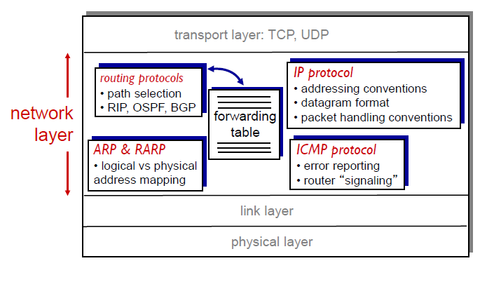
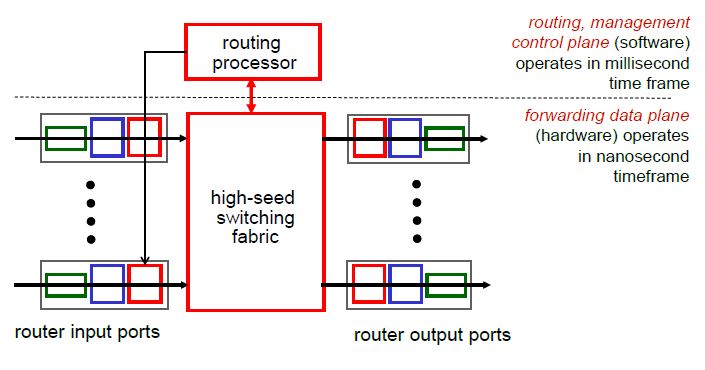
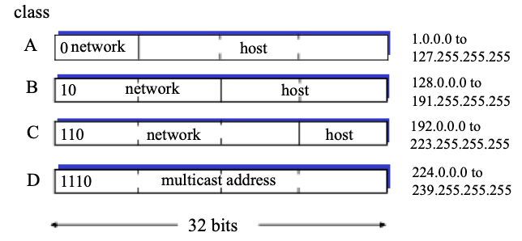
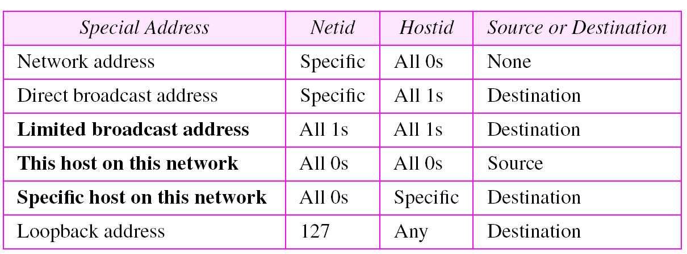
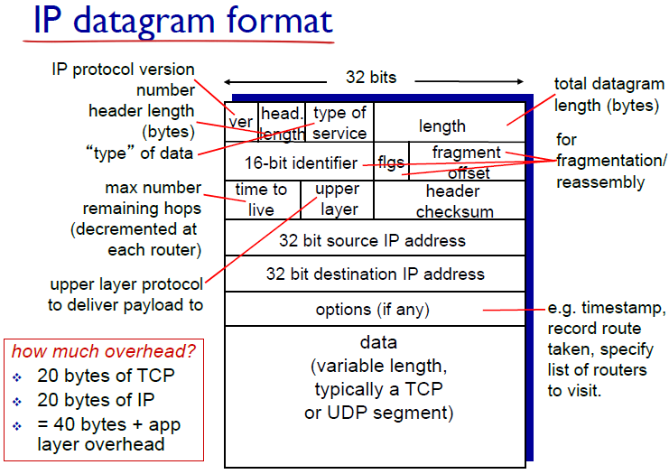
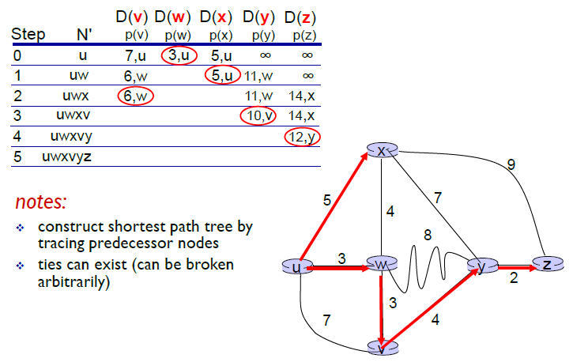
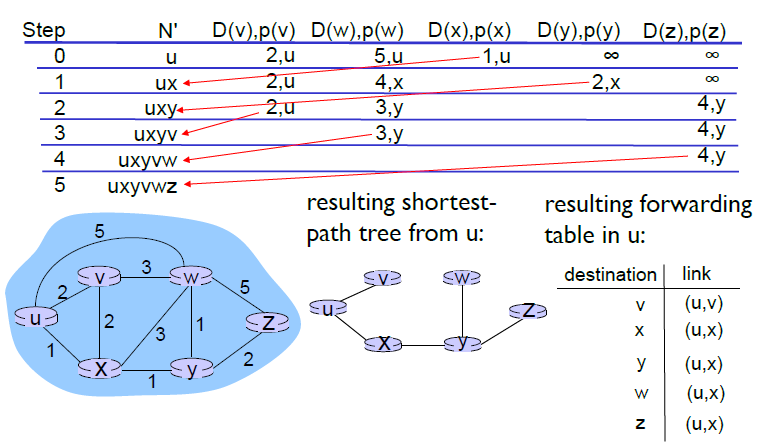
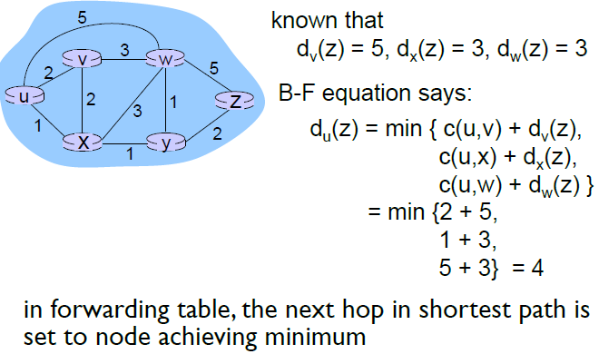

# Chapter 4&5 Network Layer

## Overview of Network Layer
- transport segments from sending to receiving host
- on sending side encapsulates segments into datagram
- on receiving side delivers segments to transport layer
- network layer protocols run in every host(router)
- router examines header fields in all IP datagrams passing through it

#### Function
- Forwarding: move pkt from router input to appropriate router's output(get through single interchange)
- Routing: determine route taken by pkt from src to dest (plan trip)
### Data plane
- local, per-router forwarding function(**input to output on router**)
- determine how datagram arriving on router input port is forwarded to router output port
### Control plane
- network-wide logic
- determine how datagram is routered among routers along end-end path from src host to dest host
- 2 approaches: 
  - traditional routing algorithms(in router)
  - software-defined networking(in remote server)

## What's inside a router

- Input port: 
  - inline termination: physical layer - bit-level reception
  - link layer protocol(receive): data link layer
  - lookup, forwarding, queueing - **decentralized switching**
    - complete input port processing at line speed
    - destination(IP addr)-based forwarding
      - *long prefix matching*
    - generalized(header field value) forwarding
    - switching fabrics(rate = pkt transfer from inputs to outputs)
      - memory(copy from memory)
      - (shared) bus(switching speed limited by bandwidth)
      - crossbar/interconnection network(overcome bus bandwidth limitations)
  - Input port Queuing
    - fabric slower than input ports combined(queue delay, loss)
    - Head-of-the-Line(HOL) blocking: queued datagram at front of queue prevents others in queue from moving forward
- Output port
  - buffering: required when arrive from switch fabric faster than transmission rate
  - scheduling discipline: chose datagram among queued datagrams for transmission
  - output port Queuing
    - buffering when arrival rate exceeds output line speed

## Internet Protocol

### IPv4 addressing
- IP address: 32 bit identifier for host, router interface.
- interface: connection b/t host/router & physical link
- IP addr. associate with each interface
- 5 class (netid:network & hostid: host on that network)
  - special addr.
- mask: 32bit binary number 255
- subnet: 
  - device interface with same netid part of IP address
  - subnet address = ip address & subnet mask

### Datagram Format
- IP protocol ver. #; header len(bytes); type of data/service; total datagram len(bytes)
- 16bit identifier; flgs; fragment offset (for fragementation/reassembly)
- time2live(max # remaining hops); upper layer; header checksum
- 32bit src IP addr
- 32bit dest IP addr
- options...
- data(variable len,TCP/UDP segment)

### Fragmentation, reassemly
最大传送单元 Max. Transfer Unit, MTU
- Fragmentation: large IP datagram divide(1 large in, 3 small out)
- len, ID, fragflag, offset(1480 byte in data field, if MTU=1500 bytes; offset = 1480/8*n)
### DCHP(Dynamic Host Configuration Protocol)
即插即用(plug-and-play)协议
- function: allow host to dynamic obtain IP address from server
- steps
  - host broadcasts "DHCP discover” msg [optional]
  - DHCP server responds with “DHCP offer” msg [optional]
  - host requests IP address: “DHCP request” msg
  - DHCP server sends address: “DHCP ACK” msg
- return: allocated IP addr, address of first-hop router, name & IP adrr. of DNS server, network mask

## Routing Protocols
### Link State
routing algorithm - Dijkstra's algorithm
- Notation
  - c(x,y) - link cost from node x to y
  - D(v) - current value of cost of path from src to dest v
  - p(v) - predecessor node on path from src tov
  - N' - set of nodes

##### Example 1

##### Example 2

### Distance vector
Bellman-Ford equation
- D(x,y) = cost of least-cost path from x to y
- D(x,y) = min{c(x,v)+d(v,y)}
- 
- if z routes through y to x, then z tell y：
  - distance from z to x is 无穷大,then y will not choose from z to x

#### Comparision of LS & DV algorithm
- message complexity
  - LS: n nodes E links； O(nE) msg sent
  - DV: exchange msg b/t neighbor only
- convergence speed
  - LS: O(n^2) computation, may oscillation
  - DV: time varies, may have routing loop, count-to-infinity problem
- Robustness(if malfunction)
  - LS:node can advertise incorrect link cost; node compute only its own table
  - DV: incorrect path cost; node routing table used by other

## Intra-AS routing in the internet
- **Make routing scalable**
  - scale: with billions of destination
    - routing table exchange would swamp link
  - network admin control routing in own network
- Intra-AS(automated systems) routing
  - routing among host/router in same network
  - router in AS run same intra-domain protocol
  - all router in different AS fun diff. routing protocol
  - gateway router: has link to router in other AS
  - Intra-AS(Interior Gateway Protocol, IGP)
    - RIP(Routing Information Protocol)
      - DV alg.
        - distance metric: # hops(max=15), each link cost I
        - DV exchange with neighbor 30sec(advertisement)
        - routing table managed by application level(UDP) process- route-D
    - OSPF(Open Shortest Path First-Dijkstra/Link-state)
      - "open": publicly available
      - link-state: pkt dissemination; topology map; route computation D alg
      - router floods OSPF link-state advertisement to all other router in entire AS
      - directly over IP
      - advanced feature
        - security: authenticated
        - multiple same-cost path allowed(1 path in RIP)
        - different service for each link
        - integrated uni-/multicast support(same topology database as OSPF)
        - hierarchical OSPF in large domain
          - 2 hierarchy: local area(LS ad. only)/backbone(detailed area topology,direction)
          - area border router: summary distance to nets won, ad. sum to other area border
          - backbone R: run OSPF routing limited
          - boundary R: connect to other AS
    - IGRP
- Inter-AS routing
  - routing among AS
  - gateway perform inter-domain routing
  - inter-AS routing job
    - learn which dest are reachable through AS2 or AS3
    - propagate this reachability info to all routers in AS1
    - determine which gateway
    - forwarding table entry(x: subnet, l: interface - least cost path)
    - *hot potato routing*: towards closest of two routers.

## Routing among the ISPs: BGP
- BGP: Border Gateway Protocol
- inter-domain routing protocol
- provide AS
  - eBGP: obtain subnet reachability info from neigh AS
  - iBGP: propagate reachability info to all AS-internal R
  - determine good router to other network based on reach. info & policy
- BGP basics
  - 2 BGP router exchange path to different dest. network
  - policy based: receive route ad. accept/decline
- Route selection
  - shortest AS path(AS already pass through)
  - closest next-hop router, hot-potato-routing(choose local gateway has least intra-domain cost)
  - local preference value attribute: policy decision
- policy routing
  - not from customer network

### Difference in Intra-AS, Inter-AS routing
- Policy
  - inter-AS: admin control over how its traffic is routed, what routes through its net
  - intra-AS: single admin, no policy decision need
- scale
  - hierarchical routing save table size, reduce update traffic
- performance
  - intra-AS: focus on performance
  - inter: policy dominate over performance