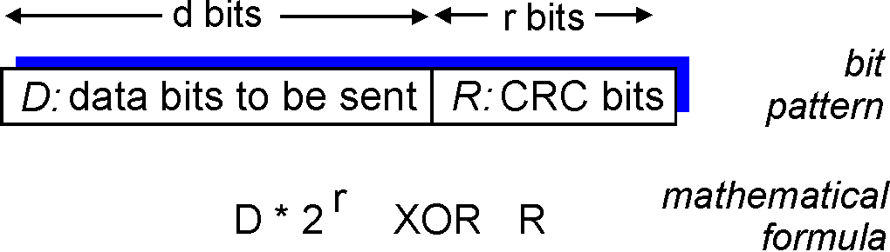
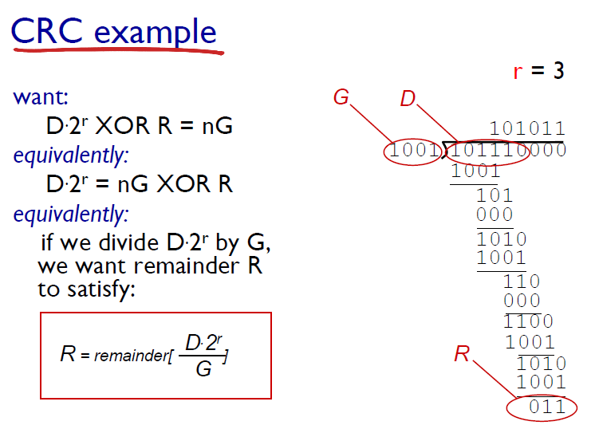
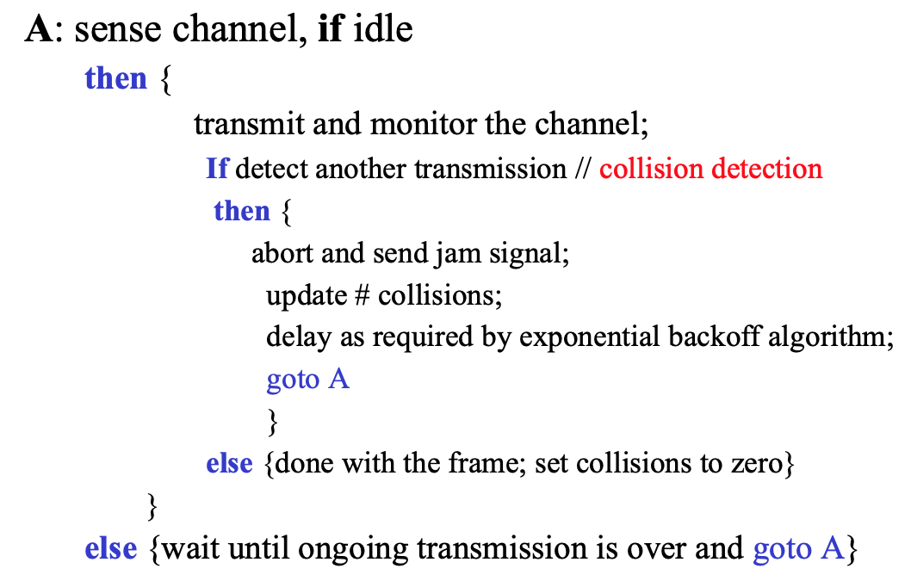
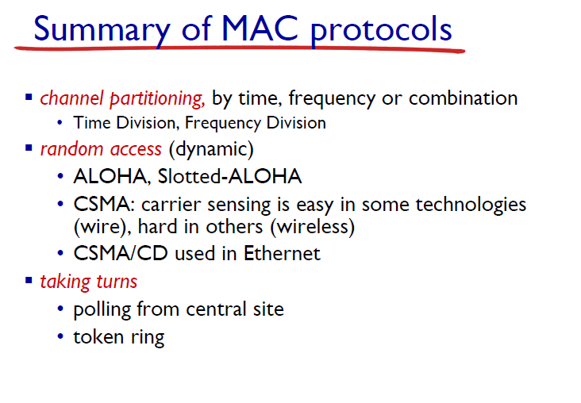

# Chapter 6 - The Link Layer and LANs

## Introduction, Services
- **Nodes**: Hosts and routers
- **Links**: communication channels that connect adjacent nodes along communication apth(wired links & wireless links)
- **Frame**: layer-2 packet, encapsulates datagram
- **Link layer** has responsibility of transferring datagram from 1 node to physically adjacent node over a link

Context:
1. datagram transferred by different link protocols over different links
2. Each link protocol provide different services

#### Services:
1. Framing, link access: encapsulate datagram into fram, add header, trailer channel access if shared medium
2. reliable delivery between adjacent nodes:
   - fiber: low bit-error link; wireless:high error rate
3. flow control: pacing b/t adjacent sending & receiving nodes
4. error detection: caused by signal attenuation/noise, detect error, signals sender for retransmission.
5. error correction: receiver identify & correct bit errors without resorting to retransmission
6. half-duplex & full-deplex: half: both end of link can transmit; not same time

Implement in: 网络适配器(Network Adapter)/网络接口卡(Network Interface Card, NIC)

#### Adaptors communicating
- sending side
  - encapsulate datagram in frame; add error checking bits, rdt, flow control
- receiving side
  - looks for erros, rdt, flow control; extract datagram, passes to upper layer

## Error Detection, Correction
- EDC = error detection & correction bits(redundancy)
- D = data protected by error checking, may include header fields
- *Larger EDC field yields better detection and correction*

#### Parity checking
- **Single bit parity**: single bit parity
- **Two-dimensional bit parity**: detect and correct single bit errors

#### Cyclic redundancy check

- D = view data bits
- G = choose r+1 bits(generator)
- R = choose r CRC bits

R = (D·2^r) % G

## Multiple Access Protocols
Two type of Link
1. point-to-point
2. broadcast

- if **Single shared broadcast channel**,
  - 2/more 同时transmission by node-**interference**
  - collision if node 同时 receive more signal
- Multiple Access Protocol
  - distributed algorithm, communication about how channel shared

#### Ideal characteristics
- 1 node want to transmit, send at rate R bps
- M nodes want to transmit, each can send at average R/M bps
- Fully decentralized(no special node coordinate transmission, no synchronization clock)
- Simple

### MAC protocols
- Channel partitioning(divide channel into smaller pieces)
  - TDMA (Time division multiple access): channel time divided into fixed length slot (slot length = packet transmission time)
  - FDMA(frequency division multiple access): channel spectrum divided into frequency bands(assign to fix, unused go idle)
- Random Access(allow collision & recovery from collision)
  - specify how to detect collision, how to recover from collision
  - slotted ALOHA.
    - assumption
      - time divided into equal size slots (time to transmit 1 frame)
      - nodes start to transmit only slot beginning
      - nodes synchronized if 2 or more nodes transmit in slot, all nodes detect collision
    - operation
      - when node obtains new frame, transmit in next slot
        - if no collision: send new frame in next slot
        - else: node retransmit frame in each subsequent slot with prob. p until success
    - Pros
      - single active node can continuously transmit at full rate
      - highly decentralized; simple
    - Cons
      - when collision, wasting slots; idle slots
      - node may detect collision less than time to transit packet
      - clock synchronization
    - efficiency(many nodes with many frames to send in long run)
      - N nodes & prob. p: N*p(1-p)^(n-1)
      - max efficiency = 1/e = 0.37 = 37%
  - pure ALOHA
    - collision when access channel at overlapped time instant
    - simpler; no synchronization
    - efficiency: p*(1-p)^(2*(N-1)) = 1/2e=0.18
  - CSMA(Carrier sense multiple access)
    - listen before transmit
      - if channel idle, transmit entire frame; else, defer transmission
    - collsion: 
      - propagation delay cause not to hear at the same time
      - if collision, entire packet transmission time wasted
  - CSMA/CD(collision detection)
    - collision detected in short time
    - colliding transmission abort, reduce wastage.
    - collision detection
      - easy in wire LANs: measure signal strengths, compare transmitted received signal
      - wireless LANs: overwhelmed by local transmission strength
    - better performance than ALOHA, simple, cheap, decentralized

- Take turns(node take turns)
  - polling: master node "invites" slave nodes to transmit in turn
    - no slotted, higher efficiency
    - polling overhead, latency, single point of failure
  - token ting: control token passed from 1 node to next sequentially

## LANs
32 bit IP address: network-layer address for interface, used for layer 3 forwarfing
**48 bit MAC/LAN/physicall address**: 
- function:locally send frame from interface to physically-connected interface
- e.g. 1A-2F-BB-76-09-AD(base 16)
- each adapter on LAN has unique LAN address
- MAC flat address(portable): can move LAN card from one LAN to another
  - ip hierarchical address not portable(depend on IP subnet)
### Addressing, ARP and RARP
Translation of Addresses
- IP-MAC: ARP(address resolution protocol) mapping
- MAC-IP: RARP(reserve ARP)
- ARP table IP/MAC address mappings for some LAN nodes:
  - < IP address; MAC address; TTL(time to live)>(TTL: time after which adress mapping will be forgotten)
- To send datagram to B(MAC address not in A's ARP table)
- A broadcasts ARP query packet, containing B's IP address(all nodes on LAN receive ARP query)
- B receives ARP packet, reply to A with its (B's) MAC address

**Routing to another LAN**

### Ethernet
- dominant wired LAN tech
- single chip, multiple speed
- simpler, cheap
- kept up with speed race

- Ethernet: physical topology: bus, star
- frame structure
  - preamble: 7byte with patter 1010 1010 follow 1 byte with patter 1010 1011
  - addr: 6byte src, dest MAC addr
  - type: 2byte indicate higher layer protocol
  - CRC: 4byte cyclic redundancy check ar receiver, error detected
  - payload(data)
- feature:
  - connectionless
  - unreliable(no ACK/NACK), drop frame recovered only if initial sender uses higher rdt;otherwise drop data lost
  - unslotted CSMA/CD with binary backoff
- ethernet CSMA/CD algorithm
  - after abort: NIC enter binary backoff
### Switches
- Switch(self-lerning)
  - link layer device: active role(store&forward ethernet frame, exam income fram's MAC,selective forward frame 1-n outgoing link)
  - transparent: host no presense of switch
  - plug&play: self-learning

- filtering/forwarding
    1. record incoming link, MAC address of sending host
    2. index switch table using MAC dest. addr
    3. if entry found for destination
        then {
            if destination on segment from which frame arrived
                then drop frame
            else forward frame on interface indicated by entry.
        }
        else flood /* forward on all interfaces except arriving interface */
- self-learning
    - MAC addr, interface, TTL
    - aging time(no frame received, delete table)
##### Switches vs. routers
- store&forward
  - routers: network-layer device
  - switches: link-layer device
- forwarding table
  - routers: compute tables using routing algorithm, IP address
  - switches: learn forwarding table using flooding, learning, MAC addresses