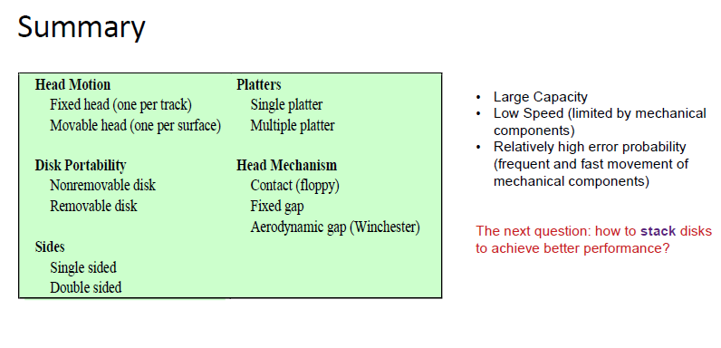

# Lecture 10 - External Memory
## Magnetic Disk
- longterm, non volatile storage
- lowest level memory: slow, large inexpensive
- rotating platter
- movable read/write head to access data
composed of
- platter
- read/write head
- spindle

### How bit stored on platter
- magnetic surface, magnetized spot(1 bit)
- orientation represent as 0 or 1
- aluminium / aluminium alloy material

### How bits read/written
- interaction b/t head & platter
- change of current cause change magnetic field
- Head covered with magnetic fields and electronic wires
- Read: magnetic (Platter) → current (Head)
- Write: current (Head) → magnetic (Platter)

### how bits organized on platter
- tracks: concentric rings
- track contains sectors
- sector = number of magnetized spot(block of data)
- size of sector vary
- *inter-sector/inter-track gap*
- **1 issue: different data rate for different tracks**
  - constant angualr velocity, but change density of spots on different tracks
    - AD: addressed by tracks & sectors
    - DIS: waste of space
  - multiple zone recording(outer track has more sectore)
    - AD: increase capacity
    - various data rate

**Disk Drive**
- disk - platters - tracks - sectors
- head has same width as tracks

### how to locate sector position within track
- extra control data as marks(use only by disk drive)

**Performance check**
- queuing delay
  - wait for device: issues an I/O request, first wait in queue for device be available.
  - wait for channel: share channel b/t processor & device

- access time: seek time and rotational delay
  - seek time: head move to right track
  - rotational delay: desired sectore rotate to the head
  - size of platter & rotation speed(factor)
- data transfer
  - rotation speed and the number of sectors(factor)

## Organization of Multiple Disks
RAID family in 7 levels
- different cahracteristis
- common characteristics
  - a logical disk drive to OS
  - data striping: divide logical sequential data(file) into segments(strip)
  - store redundant data(except RAID 0)

**Two issue**
- **I/O speed**: parallel i/o operation across many disks
- **Reliability**: introduce redundancy

**RAID 0** - Data distribution(no redundancy)
- Data segmented into strips and distributed
  - stripped Round Robin
- increase speed

**RAID 1** - Duplicated data(mirrored data)
- 2 same component

**RAID 2 & 3** - Redundancy through error correction code
- parallel access technique
  - head in the same position
  - size of strip is very small
- RAID 2 uses Hamming Code(Parity disks), not commonly use
  - Data bits and parity bits are read/write simultaneously
    - Correct error in real time
    - Good for low quality disks
  - still lots of redundancy
- RAID 3 uses a single parity bit
  - efficient than RAID 2
  - handle hardware failure
    - good for soft failures 

**RAID 4 - 6** 
- Accessed independently
- larger size strip, good for high I/O read request rate
- RAID 4
  - data update for 1 block, need reading n blocks to also update parity info
  - there's an write penalty
- RAID 5
  - no write panalty
  - Round robin allocation for parity strip(accross all disks)
  - no bottleneck
- RAID 6
  - difference: 2 parity calculation schemes(P & Q)
  - increased data availability at the cost of higher write penalty

## SSD
- Non-volatile, non-mechanical, fast access than HDD
- Controller + memory component
- NAND Flash Cell

## HDD Transfer Time

Transfer Time = Bytes transferred/(rotation speed * Bytes on track)

total average access time = average seek time + 1/2r + b/(r*N)