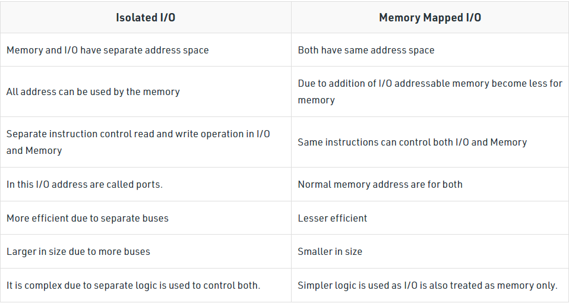

# Lecture 11 & 12 - I/O modules

I/O performance Metrics
- I/O bandwidth(throughput)
- I/O response time(latency)

## Why connector using BUS
- Why don’t directly connect external devices using system bus?
- data transfer rate & “logic”
- System bus has high data transfer rate
- External devices are much slower
- Also, there are a wide variety of devices with various transfer rates
- Hard to match – inefficiency

### BUS
- AD: varsatile: easily add new device; low cost
- DIS
  - create communication bottleneck - bus bandwidth limits the maximum I/O throughtput
  - maximum speed limited by length & number of devices

### Need of I/O module
- Interface to the processor and memory via the system bus or some central switch
- Interface to one or more external devices by some data links

## Major role of I/O module
- control & timing(coordinate flow b/t internal resource & external devices)
  - in data transfer
  - processor ask & I/O return device status.
  - if ready, processor request data
  - I/O obtain data from device

- processor communication(command, data, status)
  - command: processor - control & data bus - I/O module
  - data: exchange(processor & I/O module)
  - status: I/O report status of external device(BUSY & READY)
- device communication
  - similar but \w different code
- data buffering
  - Cope with the different data transfer rates
- error detection
  - Detect mechanical and electrical malfunctions
  - Detect soft errors using error detection code

## I/O Techniques
- I/O-to-memory through processor
  - no interrupts: programmed I/O
    - directly control I/O process
    - Processor will wait for I/O command to complete 
      - Processor sends command to I/O module
      - will do job and set I/O status register after finish job 
      - I/O module will not alert processor.
      - Processor needs to periodically check status to see job has been completed
    - Memory Mapped I/O 
      - share same address space
    - Isolated I/O
      - seperated address space for memory and device
    - 
  - use of interrupts: interrrupt-driven I/O
    - processor issue I/O commands to I/O module
    - continues its task while module perform I/O operation
    - signal ready to transfer data(interrupt)
- direct I/O-to-memory
  - direct memory access(DMA)
    - process
      - CPU requests read/write, DMA sends ACK
      - CPU sends information, then continues with other work
      - DMA then transfers the entire block of data, word by word
      - When finish, DMA sends and an interrupt signal to the processor
      - Thus, CPU only involved at the beginning and end of transfer
    - Cycle Stealing
      - CPU & DMA use system bus at the same time
      - CPU fetch data from memory when DMA wants to transfer data from memory
      - CPU pause and let DMA using bus
      - **DMA breakpoint**: where cycle stealing happens, which need hardware support
    - structure
      - Single bus, detached DMA(uses bus twice)
      - Single bus, Integrated DMA(uses bus once: DMA to memory)
      - Separated I/O bus
        - uses bus once (DMA to memory)
        - make use of DMA as the "2nd CPU"
    - Mode of DMA Transfer
      - **Burst Mode**
        - Entire data transferred before CPU takes control of buses back from DMA Controller.
        - quickest mode of DMA Transfer since huge data transferred at once. Then time saved
        - *Percentage of Time CPU remains blocked*
          - Time to prepare data be Tx 
          - Time to transfer data be Ty 
          - **percentage of time CPU remains blocked = Ty * 100% / (Tx + Ty)**
      - **Cycle Stealing Mode**
        - Slow IO device will take time to prepare data, and CPU keeps the control of buses.
        - Once ready, CPU give back control to DMA for transfer to memory in 1 cycle.
        - slower than burst mode since time consumed by I/O device while preparing data
        - *Percentage of Time CPU remains blocked*
          - Time to prepare data be Tx
          - Time to transfer data be Ty.
          - **Percentage of time CPU remains in blocked state = Ty * 100% / Tx**
      - **Interleaving Mode**
        - CPU不需要系统总线时，总线的控制权就会被交给给予DMA控制器
        - CPU will not be blocked due to DMA 
        - slowest mode: wait long time for system bus
        - less amount
    - ADV
      - allows a peripheral device to read from/write to memory without going through CPU
      - allows for faster processing 
        - processor work on sth. else while the peripheral can be populating memory
    - DIS
      - requires DMA controller to carry out operation, which increases cost of system
      - cache coherence problems

I/O command:
- Control
- Test
- Read
- Write

#### Some External Device Protocol
- Intel Direct Data I/O (DDIO)
  - cache hit: cache line updated, but not main memory
  - cache miss: write operation occurs to a line in cache that will not be written back to main memory. 

- Universal Serial Bus (USB)
  - Widely used for peripheral connections
  - Is the default interface for slower speed devices
  - Commonly used high-speed I/O
  - Has gone through multiple generations
  - USB 1.0: 1.5 Mbps to 12 Mbps
  - USB 2.0: 480 Mbps
  - USB 3.0 (SuperSpeed): Signaling speed: 5 Gbps; signaling overhead: 4 Gbps
  - USB 3.1 (SuperSpeed+): 10 Gbps; 9.7 Gbps

- FireWire Serial Bus
- SCSI(Small Computer System Interface)
- Thunderbolt
- InfiniBand

