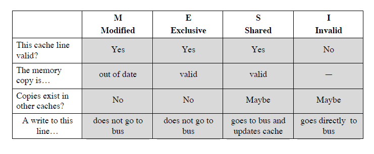

# Lecture 13 - Parallel Processing

## Parallel Computing
- Speed
- Problem size
- HPC clusters may have many nodes
- Using more nodes/processes does not always make your program run faster

## Define words
- Cluster: A collection of interconnected computers.
- Node/machine: A single machine or a node in the cluster.
- CPU/Core: The physical device in a computer that make computations. A  laptop will have about 4-8 cores. A node in HPC cluster may have many  cores.
- GPU: Graphical Processing Unit. A computing unit, separate from the  CPU. A GPU can conduct fast computations. (e.g Nvidia, MIC)
- TPU: Tensor Processing Unit. A computing unit, dedicated to servicing  and fitting Deep Neural Networks
- Process: A sequence of actions (instruction) runs in RAM, with  accompanying data. Interpreted languages like R, and Python operate on processes
- Thread: A sub-sequence of instructions, within a process. Various  threads in a process may see the same memory
- Shared memory: In HPC, it supports the shared memory model. Program  processes can exchange data by reading and writing in the common disk  system (shared drives)

## Bus organization
- AD
  - Simplicity
  - Flexibility
  - Reliability
- DIS
  - performance
  - each processor should have cache memory
  - cache coherence
    - If a word altered in one cache it could invalidate a word in another cache
    - 

## Multiprocessor Operating System Design  Considerations
- Simultanceous concurrent process
- Scheduling
- Synchronization
- Memory management
- Realiability and fault tolerance	

## MESI Protocol

## Multithreading and Chip Multiprocessors
- Processor performance can be measured by the rate at which it executes  instructionsPS rate = f * IPC • 
- f = processor clock frequency, in MHz
- IPC = average instructions per cycle
- Increase performance by increasing clock frequency and increasing  instructions that complete during cycleltithreading • A
- Allows for a high degree of instruction-level parallelism without increasing circuit  complexity or power consumption
- Instruction stream is divided into several smaller streams, known as threads, that  can be executed in parallel

## Explicit Multithreading
- Interleaved
- Blocked
- Simuletaneous(SMT Chip multiprocessing

OS Design Issue
- Failover
- Failback
- Load balaning
	
Instruction Stream
- SISD：single instruction stream, single data stream.
- SIMD：single instruction stream, multiple data  stream.
- MISD：multiple instruction stream, single  data stream.
- IMD：multiple instruction stream,  multiple data stream

Uniform memory access (UMA)
- All processors have access to all parts of main memory using loads and stores • Access time to all regions of memory is the sameAccess time to memory for different processors is the samee

Nonuniform memory access (NUMA)
- All processors have access to all parts of main memory using loads and stores 
- Access time of processor differs depending on which region of main memory is  being accessed

Different processors access different regions of memory at different speeds 
- cache-coherent NUMA (CC-NUMA) 
- A NUMA system in which cache coherence is maintained among the caches of the various processors
	
