# Lecture 4/5 - Digital Logic

## Boolean Algrbra

### How to do logic operations
 - A AND B = 𝐴⋅𝐵, A OR B = 𝐴+𝐵, NOT A = 𝐴
 - A NAND B = NOT (A AND B) = 𝐴⋅𝐵
 - A NOR B = NOT (A OR B) = 𝐴+𝐵
 - A XOR B = 𝐴⊕𝐵(exclusive or: 1 if only one of A and B is 1)

|   Operation	|   Expression	|   Output = 1 if	|
|---	|---	|---	|
|    AND 	|   A·B...	|   all of the set{A,B,...} are 1	|
|    OR	|   A+B+...	|   any of the set ... are 1	|
|    NAND	|   not(A·B...)	|   any of the set ... are 0	|
|    NOR	|   not(A+B+...)	|   all of the set ... are 0	|
|    XOR	|   A⊕B	|   the set contain an odd number of 1	|

#### switching function
Z = F(A,B,C,...)
different ways of mapping

##### truth table(0/1)
|   A	|   B	|   Z=f(A,B)	|
|---	|---	|---	|

---
### basic properties
|   Relationship	|   Dual	|   Property	|
|---	|---	|---	|
|   AB = BA  	|   A+B=B+A	|   Commutative	|
|   A(B+C)  	|   A+BC = (A+B)(A+C)	|   Distribution	|
|   1A = A  	|   0+A=A	|   Identity	|
|   A*(not A)  	|   A+(not A) = 1	|   Complement	|

**duality**
|   Relationship  	|   Dual	|   Property	|
|---	|---	|---	|
|   0A=A	|   1+A=1	|   Zero and one theorem	|
|   A*A=A  	|   A+A=A	|   Idempotence	|
|   A(BC)  	|   A+(B+C)=(A+B)+C	|   Associative	|
|   not(not A)  	|   	|   Involution	|
|   not(AB)=not A + not B  	|   not(A+B)=(notA)(notB)	|   DeMorgan's Theorem	|
|   AB+(notA)C+BC=AB+(notA)C  	|   (A+B)(notA+C)(B+C)=(A+B)(notA+C)|   Consensus Theorem	|
|   A(A+B)  	|   A+AB=A	|   Absorption Theorem	|

Completeness of Functionality
 - AND, OR, NOT
 - AND NOT
 - OR, NOT
 - NAND
 - NOR
 - **AND & NOT Prove DeMorgan's Theorem:**DeMorgan’s law: not(𝐴𝐵)=not 𝐴+not 𝐵; not(𝐴+𝐵)=𝐴𝐵 **--and, not--**
 - **PROVE NAND:** A NAND A = NOT A - prove by A NAND B = NOT(A AND B)

**Why we need NAND and NOR as complete set**
3 NAND = 1 AND
𝐴𝐵 = not(not 𝐴𝐵) = 𝐴𝐵⋅𝐴𝐵 = (A NAND B) NAND (A NAND B)

---

## Combinational Logic
### Logic gate
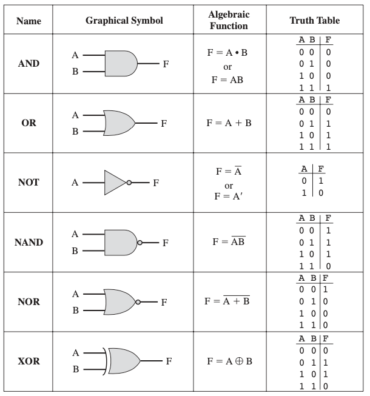

**NAND GATE to implement NOT, AND and OR**
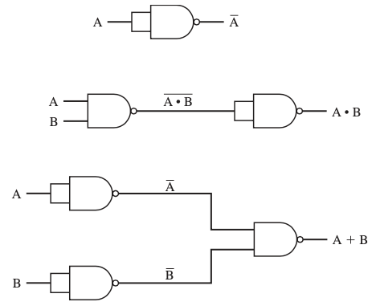

#### Three representation of a circuit
- Switching function(Z=f(A,B,...)) = logical expression
- circuit
- truth table
need to know how to translate

**SOP to circuit**
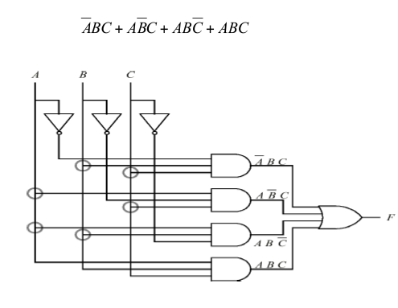

**get SOP(sum of product)**
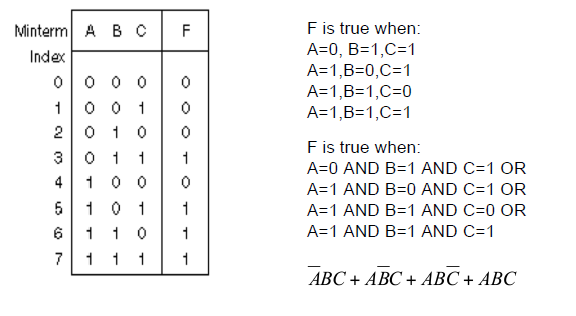
 - find F=1, find product of each input(if 1 use A; if 0 use not A), and plus together
 - (not A)BC + A(not B)C + AB(not C) + ABC

**get POS(product of sum)**
 - find F=0, find sum of each input, (**if 0 use A**, if 1 use not A), then multiply together
 - (𝐴 + 𝐵 + 𝐶) (𝐴 + 𝐵 + not 𝐶) (𝐴 + not 𝐵 + 𝐶) (not 𝐴 + 𝐵 + 𝐶)

**POS to circuit**
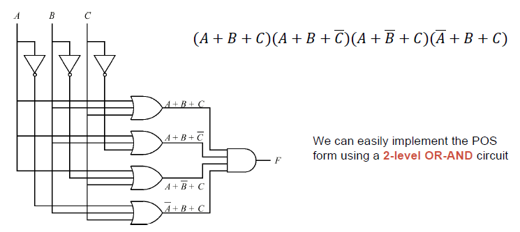

**SOP ot POS**
- less 1’s in F use SOP
- less 0’s in F use POS
- shorter expression less gate

---
### common components

**Multiplier(MUX)**
1. N-to-1 MUX
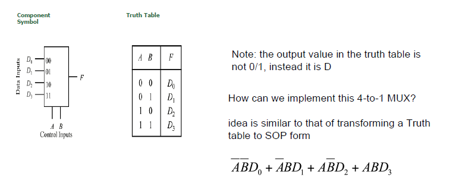
Application: reduce usage of wire(one single output wire)
 - access registers using MUX

1. DEMUX(demultiplier)
decoder 
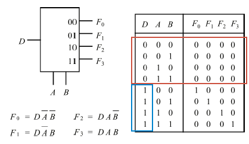

**Binary Adder**
1-bit/n-bit binary adder

---
### simplification
#### algebraic
example
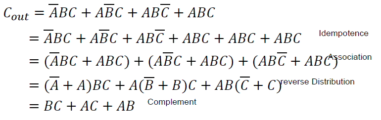

#### K-map
(if 1 use X, if 0 use NOT X)
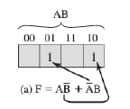
1. grouping square into blocks(2^i squares)
2. derive term from block

**other feature**
don't care condition
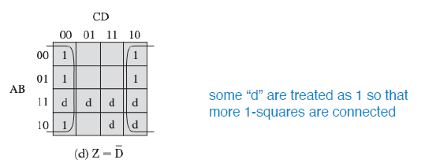
#####minterm
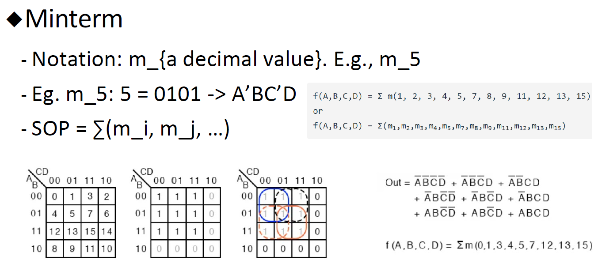
#####maxterm
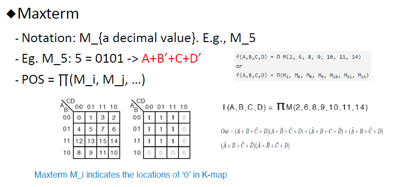

##### use k-map to simplify POS
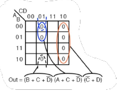

#### Quine-McKluskey table(more variable)
- AB+AB’=A(B+B’)=A
- ABC+ABC’=AB(C+C’)=AB
differ in exact one position, simplify

### Combinational circuit vs Squential circuit

### Sequential circuit
flip-flop
 - edge triggered

