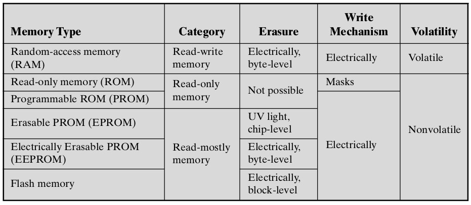
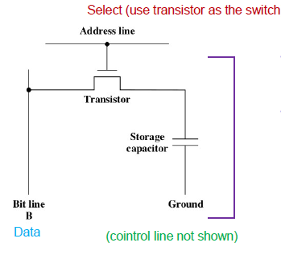
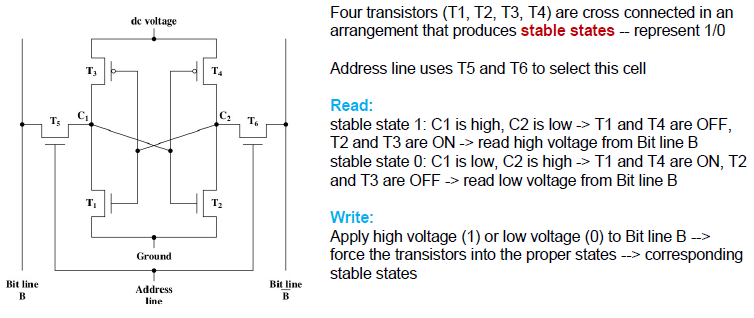
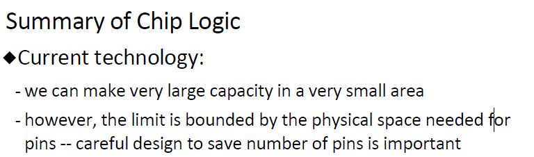

# Lecture 9 - Internal Memory

## overview of Internal Memory
- Main memory, register, cache, ROM
- semiconductor tech
- random access method
- cope with speed of CPU

two stable states: represent 0 and 1
### RAM tech - Dynamic RAM
- dynamic: periodic charge refreshing to maintain ta storage
- write:high (low) voltage applied to Bit line to charge the capacitor for 1 (0)
- read: charge stored in the capacitor fed out onto the Bit line, a sense amplifier can compare the capacitor voltage to a reference value 

### RAM tech - Static RAM
- hold data as power is on

### Difference
- **Common:** volatile -- need continuous power
- Difference
  - DRAM
    - simpler and smaller, thus denser(more cell per unit), less exprensive
    - require supporting refresh circuitry
    - tend for large memory requirement
    - for main memory
  - SRAM: faster for cache

### different ROM
Nonvolatile, no need for continuous power
- contain permanent data
- into chip during fabrication process(no room for error)
- usage: system program

- PROM(programmable)
  - written into only once
- read-mostly memory
  - re-write memory, higher cost
  - read operation far more frequent than write operation
- EPROM(erasable PROM)
  - before write opration, erased all storage cell(exposure to UV radiation), then write
  - read - exposure - write
  - more flexible
- EEPROM(electronic erasable PROM)
  - update happen at byte level
  - write longer than read
  - more expensive & less dense than EPROM
- Flash memory
  - erase at block level

## Chip Logic(how bits organized and accessed in Chip)
semiconductor memory
- array of memory cell
- provide address to chip, access bit
- how to organize & wire cell in chips to satisfy the need of addressing

### How to group cell into a logic piece of data
- extreme: 1 bit to 1 word at a time
- in between: k bits for 1 chip, combine n chips to get a word

## Error detection & correction (mechanism to detect/correct errors through coding)

- hard failure
  - permanent physical defect to cells
  - replacement
- soft error
  - random non-destructive event, cell content modified
  - function is ok
- error detection
  - how to know errors in block of data.
  - hash function
- error correction
  - detect and recover correct content
- coding theory
  - use redundancy to encode condition which correct data should satisfy

**Single parity code**
encoding rule

- **General Case**
- original data M bits, redundancy K bis, together N = M+K

- N+1 case:
  - case 0: no error
  - case 1: error at position 1
  - case t: errot at position t
  - 

