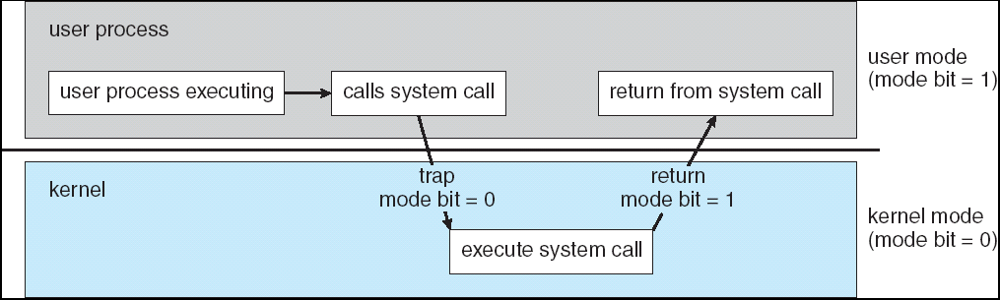

# Lecture 2 - Interrupts and System Calls

## I/O processing

- synchronous
  - program waits until I/O completes
  - no simultaneous I/O processing
- asynchronous
  - user program continues to execute without waiting for I/O to complete
  - I/O complete, program receive interrupt
  - simultaneous I/O processing
  - device-status table: each I/O device

## Interrupt processing
- def: a signal to CPU to tell it about occurence of a major event
- type:
  - according to priority
    - maskable interrupt: maybe ignored or handled later, low priority one is maskable
    - non-maskable interrupt: cannot be ignored. CPU must handle interrupt immediately
  - according to causes
    - program interrupt (trap)
      - CPU error/special instruction
      -  e.g. illegal instruction, overflow, devision by zero, memory access violation
    - I/O interrupt
      - I/O related events
      - e.g. I/O completion, device errors
    - Timer interrupt
      - caused by hardware timer
      - handle time-related activities
- Interrupt Handling/interrupt service routine(ISR)
  - **jump**/Stack
  - a program to handle interrupt
  - stored in *interrupt table* with an index to identify
  - when interrupt, corresponding interrupt handling will be run

## OS operation
#### Program interrupts implementation by OS
- OS: interrupt-driven
  - allow OS to gain control of the system when necessary
- privilegd commands: special interrupt-related commands
- trap is a software-generated interrupt
- timer interrupt mechanisom
- dual-mode operation
  
  - user mode: only normal instructions available but not privileged instructions
  - kernel mode(system mode): all instructions available
  - mode bit: distinguish b/t user(on)/kernel(off)

## System calls and system programs
- def: user process to do I/O that needs to execute privileged instructions
- program interrupt(trap) that
  - changes from user mode to kernel mode
  - execute privileged I/O command
  - return system calls
  - revert back to user mode to continue execution
- API to execute system functions by user programs
- system call table / system call routines with index(like interrupt)
- types of system call
  - process control
  - file management
  - device management
  - info maintenance
  - communications
- parameter passing
  - 3 general method
    - register on CPU
    - table (block on memory)
      - pass address of block as parameter in register
    - stack(on stack of program)
- types of system programs
  - file management
  - file modification
  - status information
  - programming language support
  - program loading and execution
  - communication

## OS types and structures
- Types of OS
  - batch processing
  - multiprogramming
  - time-sharing
  - real-time
  - distributed
- OS paradigms
  - simple OS: MS-DOS
  - Layered OS: Unix and Linux
    - advantages
      - reliability
      - security
      - speed
      - cost
      - open source
    - structure 2 layers
      - kernel and system programs(supplement)
    - micro-kernel system
      - microkernel approach: move as many as possible of system programs from the kernel into user space to become user programs
      - advantage
        - easier to extend, port OS to new architecture/hardware
        - more reliable/more secure
  - modular OS: solaris