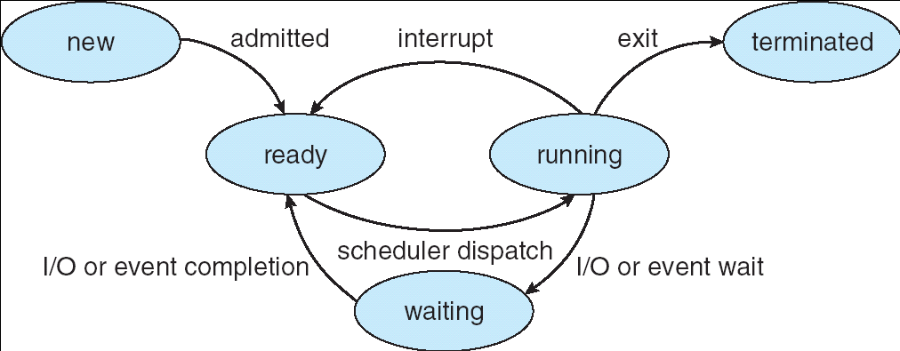
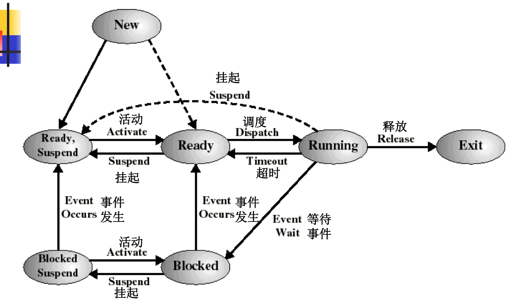
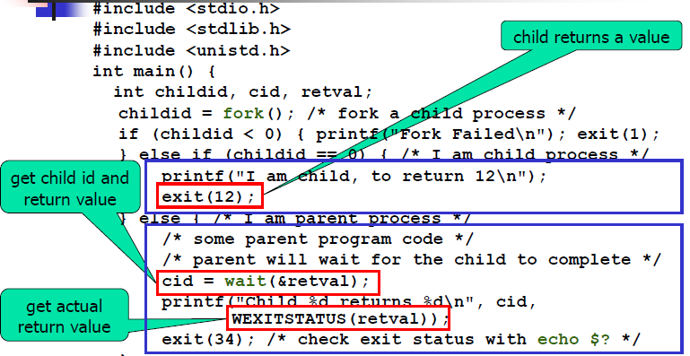

# Process Management
## Processes
- def: a program in execution
- components in memory(**not covered**)
  - value of program counter
  - value of registers and processor status word
  - stack for temporary
  - text for program code
  - data section for global variables
  - heap for dynamic storage of variable(malloc)
- Types (**not covered**)
  - I/O-bound
    - time: I/O > computation
    - **device contention**: competition to access I/O devices
      - **Lower** is better
    - **Poor use of CPU**
    - **high CPU utilization**
    - **low device contention**
  - CPU-bound
    - time:computation > I/O
    - **CPU utilization**: % of time CPU is used
      - **Higher** is better
    - **poor device utilization**
  - *transferable, not binary*
- states: condition of a process
  - new, running, waiting, ready, terminated
  
  
- **process control block(data structure)**
  - keep track of state of a process and the information that should be maintained when the process switches between CPUs
  - include
    - process states
    - process counter
    - CPU register
      - register
      - stack pointer
      - PSW
    - CPU scheduling info
      - process priority
      - pointer to scheduling queue
    - memory-mangement info
      - limit momory boundary
    - account info
      - process ID
      - CPU time used
    - I/O status info
      - list of opened files
  - **CPU switching example**: 
    - P0 pass CPU to process P1
    - by P0 **interrupted** or **executes system call**
    - 保存旧进程状态,为新进程调入所保留的状态
- Queue in OS
  - Job queue: 在系统中的所有进程
  - ready queue: 就绪并等待执行的所有进程
  - device queue: waiting for an I/O device

## Scheduler for processes
def: select process to be served when it is waiting for different services
- short-term scheduler/CPU scheduler
  - 选择可被执行并分配CPU的process
  - invoke切换频率高
  - allocation of CPU
  - fast decision-making
  - **first-come-first serve**
- long-term scheduler/job scheduler
  - 选择可以进入ready-queue的process
  - admission of jobs
  - afford longer running time
  - deg of multi-programming
  - make decision to mix CPU-bound and I/O bound processes
- medium-term scheduler缓和内存紧张
  - swap process in/out of ready queue
  - control deg of multi-programmming after process admission
- context switching
  - interrupt: time-expire interrupt or system call to I/O

## Process creation and termination
- relationship b/t parent and child process
  - resource sharing(all resource/subset of parent's resources/no sharing)
  - execution(concurrently/parent waits until child terminate)
  - address space(child duplicates that of parent/independent program)
- in Unix/Linux
  - resource sharing: none
  - execute: concurrently
  - **fork()**: child duplicates that of parent
  - **exec()**: child has independent program loaded into it
  - **wait**: for child to collect
  - **exit**: terminate
- *hierarchy of process* (tree)
- **termination**
  - **zombie process**: process has stop but parent not called **wait()**
  - **orphan process**: process has no parent

## Unix/Linux processes
#### Process creation

#### Process termination

## Process communication and synchronizing
- cooperating processes
  - affect or affected by the exectution of another process 影响另一个进程执行或被另一个进程执行影响
  - web server/web browser
  - advantage
    - info sharing
    - computation speed-up
    - modularity
    - convenience
- interprocess communication
  - shared memory system
    - read/write to shared variable(may data inconsistent)
  - memory passing system(**Prefer**)
    - passing info without using shared variable
    - operation: physical/logical communciation link
  - **send/receive message**
- synchronizing
  - order execution of cooperating processes
  - wait for signal to continue
