# Lecture 1 Overview, Introduction, Graph
## Network and Graph
- Graph = Object + Connection/Relationship
- Node - vertex
- Link - edge

#### Isomorphism
intrinsic structure of two graphs are the same

# Lecture 2 - Graph, big data verification
## Path, Connected Graph, Connected Component
- Path: sequence of nodes with property (each consecutive pair) in sequence connected by a edge
- *shortest path

Concepts:
- connected graph/connected component: subset, maximal
- bipartite graph: does not contain cycle with an odd number of nodes
- breadth-first-search(BFS): Search from one node to another

## General study methodologies
- properties of nodes, links, graphs
- real world problems transformed into graph
- how to interference from properties(solve problems)

## Clustering Coefficient
- importance of certain node
- clustering coefficient pf A = friend pairs of node A/total pair of connected nodes of node A
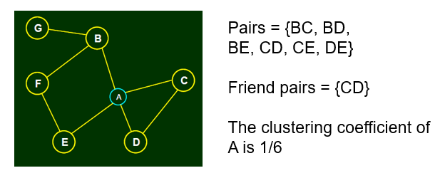

## Triadic Closure
(evolution along times increase)
- if who originally don't know each other, they have an increasing chance to get to know each other

### Triadic Closure Verification using Big Data
how many number of common friend
1. identify the edge don't pair together. 
2. find common friends
3. probability to be friends(with number of common friends)
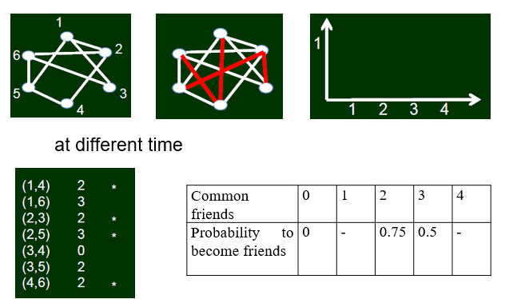

#### social interpretation -> qualitative -> qualitative description
- relationship of nodes changes along time.

## Structural Holes
- After removing of which, makes the network become multiple connected components
- access to non-interacting parts
- less redundancy, more social capital
- e.g. 1 node is also a component.

## Embeddedness
- number of common neighbors of a link
- e.g. embeddedness of (A, B) = 2

## Strong tie, weak tie
- property of link

### strong triadic closure
- (A, B) and (A, C) has strong tie, but there's no edge at all. so violate the strong triadic closure property. 
- no common friend -> weak ties

## Short cuts
connecting two nodes without which will lead to a long distance

## bridge
after removal, number of connected components increases

# Lecture 3 - Homophily, big data analysis
## Homophily
- common
- selection and social influence

## Measuring homophily
definition of similarity can be different in different problems

- degree of similarity
  - 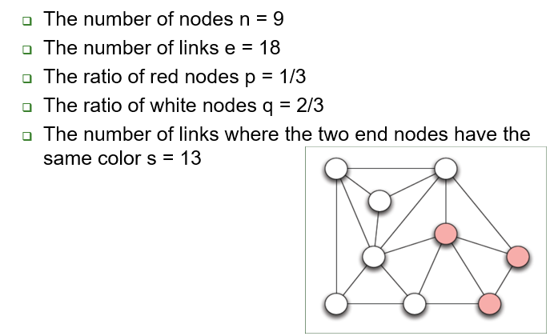
  - more link with same color node, higher homophily
  - number of links(node color not same)/all links(s/e)
  - s/e vs. sum of ratio of different color nodes

## Selection vs. Social Influence(mechanism)
selection:
- become friends because of common interests
//affiliation network

social influence: 
- join another club/organization together
- closure because of a common friend, but because of influence by a friend

## 3 types of closure
triadic closure
Selection -> focal closure
social influence -> membership closure
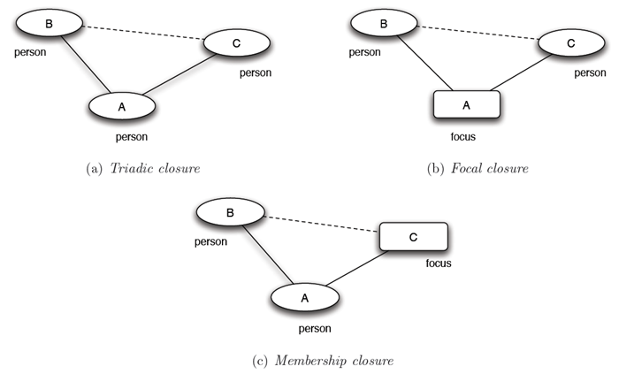

## focal closure
- shared foci, connection
- more shared foci, higher chance of connection

## Membership closure
- a friend has certain focus -> join the focus
- more friend in a focus, higher probability

## big data analysis on origin of homophily
measure similarity: 
e.g. editor&wiki article: (X和Y都编辑的文章数量)/(X或Y中至少有一人编辑的文章数量)

## Schelling Model
- agent live in a cell. 2 types of agents, x and o
- constraint: certain number of same-type neighbors

# Lecture 4 - Small World
## Small world problem
- median = 6
- six degree of seperation

## Decentralized search
- every node can only see its neighboring nodes

## decentralized search vs. breadth first search
- BFS: send to every friends, reach target
- DS: may fails to reach target person

## phenomenon
- not straightforward
- network is quite sparse

## limitation
- no short path

## Watts-Strogatz-Kleinberg model
The probability that two nodes have a random link is inverse proportional to their grid distance with exponent q.(q=2)

## Verification with big data
optimal q

# Lecture 5 - Core-Periphery Structure, Directed Graph, Web Structure
## Core-periphery Structure
- importance of people
- not reflected in decentralized search
- social status can be reflected by network structure

## Directed Graph
relationship with direction
- strong connectivity

## strong connected component
1. every node in subset has path to every other
2. subset is not part of some larger set with property that every node can reach every other

## Bowtie Structure

**How to obtain SCC, IN, OUT**
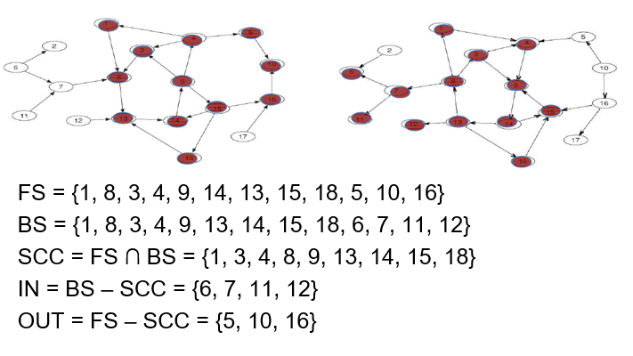

proof SCC: all nodes in SCC are connected, no bigger SCC

# Lecture 6 PageRank

## Hub and Authorities
**auth(p) hub(p)----HITS algorithem**
- input: directed graph
- initialization: for every p, auth(p)=1, hub(p)= 1
- authority update rule: auth(p) = sum of hub score of all page that point to it
- hub update rule: hub(p) = sum of authority score of all pages that it points to
- repeat

Information
- **Auth(a) = sum of Hub(a-in)**
- **Hub(a) = sum of Auth(a-out)**
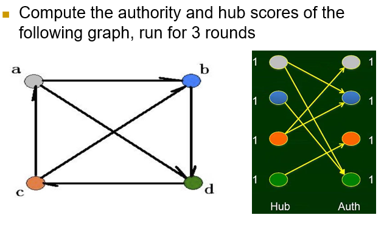
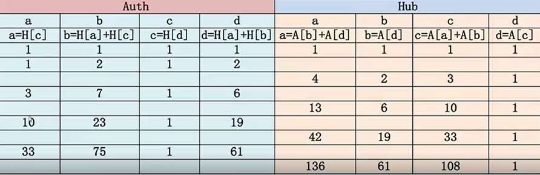

## PageRank
- share
- outgoing links with equal share

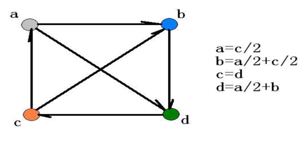

# Lecture 6 & 7 & 8 - Game Theory

## Game Theory(Pure Strategy)
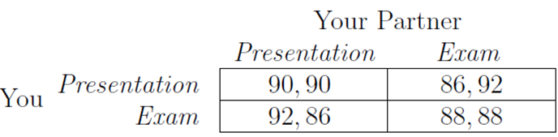
basic ingredients of game
1. set of participants
2. set of option(strategies)
3. received payoff situation
4. received payoff matrix

## (Strictly) Best Response & (Strictly) Dominant strategy
- Best response: A’s strategy can maximize A's payoff when response to one of B’s strategy
- strict best response: uniqueness
- Dominant strategy: A’s dominant strategy is the best response to every strategies of B
- Strictly dominant strategy: uniqueness
- Result
  - If both have strictly dominant strategy, both will adopt them
  - Only A has strictly dominant strategy, A will adopt it and B will adopt the best response to this strictly dominant strategy

## Nash Equibilrium
- best response to each other
- no onw can be better by unilaterally change his own strategy; though both can become better if both changes

## Multiple Equilibria
- need more information
- only narrow down the choice, but may not guarantee to predict

## Mixed Strategies(no Nash Equilibrium)
- probability: randomness *distribution
- Expectation: E(X) = ap + b(1-p)
  - Expectation(A chose S1) = a1p+b1(1-p)
  - Expectation(A chose S2) = a2p+b2(1-p)
  - Ex(A-S1) = EX(A-S2)
  - Expectation(B chose S3) = c1q+d1(1-q)
  - Expectation(B chose S4) = c2q+d2(1-q)
  - Ex(B-S3) = EX(B-S3)

- set of probability distribution making the other player indifferent in choosing any his pure strategy

## pure strategy vs. mixed strategy
1. Pure Strategy
2. Mixed Strategy: p & q

## Pareto Optimality
- if there's no other choice of strategy in which all players receive payoff at least as high, at least one player receives a stritcly higher payoff
## Social Optimality
- maximize sum of the players' payoffs

# Lecture 9 & 10 - Network Traffic, Auction, Matching market
## Game on Network Structure
Ingredients
1. Players: # of drives
2. Strategy set
3. Driver's Payoff: travel time(the less the better, depend on other's choice)

4. Equilibrium: no one has incentive to change
5. if anyone deviates, his pyoff will be: ...

##### Braess's Paradox
- Invest more resources may not get a good result

## Auction
Ingredients in Game
- Participant: sellers and buyers
- Strategy: bid
- Payoff: for buyers: value of the object; for sellers: the paid price for object
- Equilibrium:the best response for each other

## Matching
- perfect matching: every one has object satisfied 

## Market invisible hand
- players: sellers, buyers
- strategy: valuation, choice
- payoff: deal or not
- Payoff of seller a, b, c & buyer x, y, z
- social welfare: sum of everyone's payoff
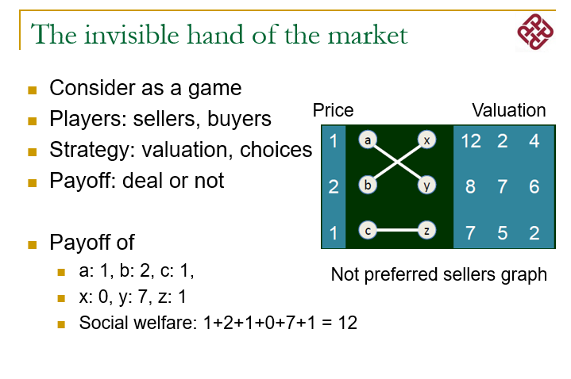

## Market-clearing prices
- Prices combination set that maximize the social welfare

# Lecture 10 & 11 - Sponsered search market
##### Sponsered search market
- combination of matching and auction
## Concepts
- advertising slots
- clickthrough rate: expected click per hour on an ad slot
- advertiser's revenue per click: the expected revenue of every click
- advertiser's valuation: = clickthrough rate * revenue per click
- advertiser's payoff: (expected revenue - price) * clickthrough rate

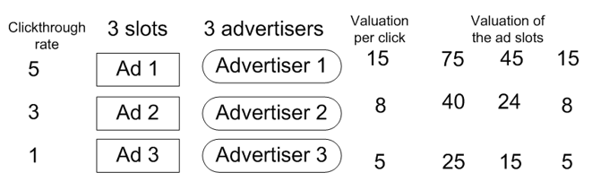

## Vickrey-Clareke-Groves(VCG) Mechanism
P(ij) = V(S,B-j) - B(S-i,B-j)

- buyer j bids true valuation and get slot i, payoff = v(ij)-p(ij)
- change to slot h, payoff = v(hj)-p(hj)
- need to show: v(ij)-p(ij) >= v(hj)-p(hj)
- translate to: v(ij) - [V(S,B-j) - V(S-i,B-j)] >= v(hj) - [V(S,B-j) - V(S-h,B-j)]
- which is: v(ij) + V(S-i, B-j) >= v(hj) + V(S-h, B-j)
- because we know: v(ij) + V(S-i, B-j) = V(S,B)
- and v(hj) + V(S-h, B-j) <= V(S,B)

## Generalized Second-Price(GSP) Auction
payoff = v(i)r(i) - b(i+1)r(i)

